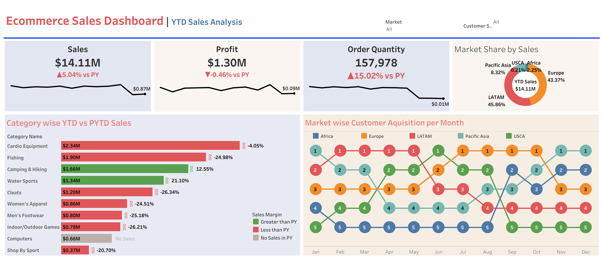

# Ecommerce Sales Dashboard | YTD Sales Analysis

## Project Overview
This project analyzes e-commerce sales performance using a Tableau dashboard focused on year-to-date sales trends, profit, order quantity, category performance, and market-wise customer acquisition.

## Objective
To monitor key sales KPIs, compare YTD vs PYTD performance, and identify category and market trends that can support business decision-making.

## Tools Used
- Tableau
- Excel / CSV
- Data Cleaning
- Business KPI Analysis

## Dataset
Dataco sales dataset

## Key Metrics Tracked
- Total Sales
- Total Profit
- Order Quantity
- Market Share by Sales
- Category-wise YTD vs PYTD Sales
- Market-wise Customer Acquisition per Month

## Dashboard Preview


## Live Dashboard
[View Interactive Tableau Dashboard](https://public.tableau.com/views/EcommerceSalesDashboard_17756128293440/EcommerceSalesDashboard?:language=en-US&publish=yes&:sid=&:redirect=auth&:display_count=n&:origin=viz_share_link)

## Key Insights
- Sales reached **$14.11M**, showing **5.04% growth vs previous year**
- Profit was **$1.30M**, slightly down by **0.46% vs previous year**
- Order quantity increased by **15.02%**, indicating strong volume growth
- LATAM and Europe contributed the highest share of sales
- Camping & Hiking and Water Sports showed positive year-over-year category growth
- Categories like Fishing, Cleats, and Women’s Apparel declined compared to the previous year

## Business Recommendations
- Investigate why profit declined despite higher sales and order volume
- Focus on high-growth categories such as Camping & Hiking and Water Sports
- Review underperforming categories and pricing strategy
- Expand acquisition efforts in high-contributing markets
- Analyze product mix and margin trends by region

## Repository Structure
```text
ecommerce-sales-dashboard/
│
├── data/
├── images/
├── dashboard/
└── README.md
